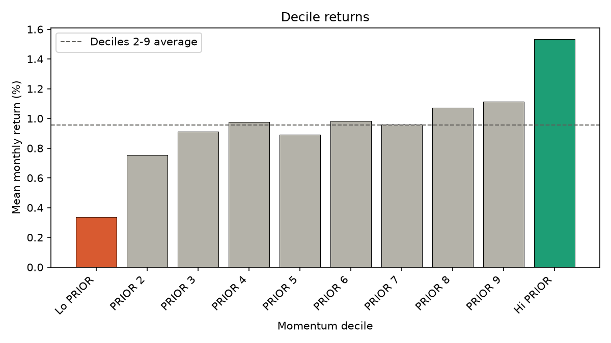
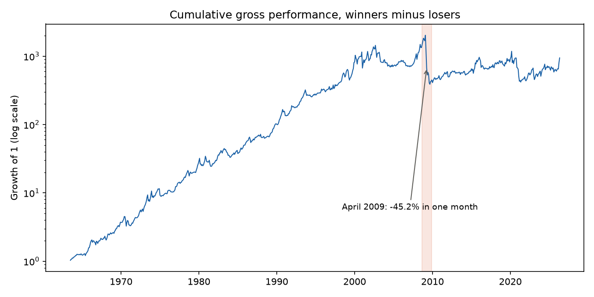
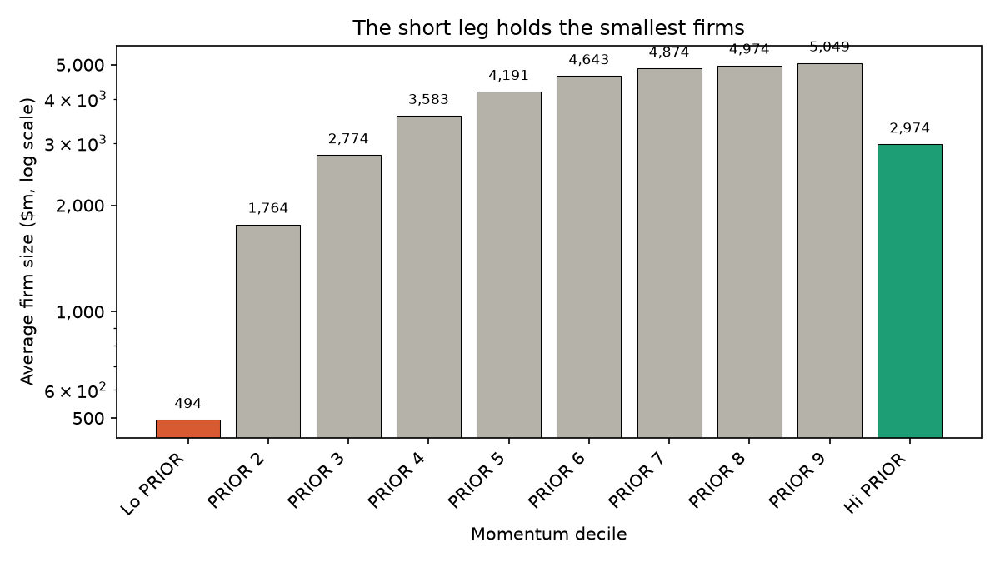

# Momentum: where does the alpha go?

Buy last year's winners, short last year's losers, rebalance monthly. On US stocks from 1963 to 2026 that returns 14.4% a year before costs.

Regressed on the four F-F standard factors, 81% of it is the published momentum factor. The 4.3% left over is just the same factor, more concentrated. And it doesn't survive realistic trading costs.

My work is documented step by step in this repo. Every choice was written down in [SPEC.md](SPEC.md) and committed before I ran a regression.

Setup instructions are at the bottom.

## Data

I used the monthly series from the [Kenneth French Data Library](https://mba.tuck.dartmouth.edu/pages/faculty/ken.french/data_library.html), 1963-07 to 2026-05, 755 observations:

- `F-F_Research_Data_Factors`: market, size and value factors, plus the risk-free rate
- `F-F_Momentum_Factor`: the published momentum factor `Mom`
- `10_Portfolios_Prior_12_2`: 10 portfolios sorted on the return from month t-12 to t-2

My strategy is the top decile minus the bottom decile: long past winners, short past losers, rebalanced monthly. It is self-financing, so it is already an excess return and the risk-free rate is not subtracted.

## Where the return comes from



The middle of the ranking is flat. Deciles 2 to 9 all sit within a narrow band around 0.96% per month (the average), and the ordering inside that band is not even monotonic. The entire spread comes from the two extremes: the Lo decile at 0.34% and the Hi decile at 1.53%.

## The regressions (models components are in [SPEC.md](SPEC.md))

Each model adds a factor to the list of things treated as ordinary exposure. The intercept is what remains unexplained. I use Newey-West HAC standard errors, because monthly stock returns don't have constant variance (i.e heteroskedastic) and aren't independent from one month to the next (i.e autocorrelated); plain OLS standard errors would be too small and would make everything look more significant than it is (inflated t-statistics).

| Model | Alpha (ann. %) | 95% CI | t | adj R² | Mkt-RF | SMB | HML | Mom |
|---|---|---|---|---|---|---|---|---|
| Market | 16.65 | [11.03, 22.27] | 5.81 | 0.04 | -0.32 | | | |
| FF3 | 19.63 | [14.23, 25.04] | 7.12 | 0.10 | -0.37 | -0.21 | -0.64 | |
| FF4 | 4.29 | [1.86, 6.72] | 3.46 | 0.81 | -0.07 | -0.15 | -0.12 | 1.53 |

Three things are worth reading off this table.

**Market, size and value explain almost nothing;** Adjusted R² is 0.04 and 0.10. The strategy is close to market-neutral by construction, and its exposures to size and value are negative.

**Alpha rises from the first model to the second;** This is not a mistake. The SMB and HML loadings are negative while both premia are positive, so those exposures cost the strategy money. Removing them leaves more unexplained. The HML loading of -0.64 is the strongest of the three: momentum buys what has risen, which is by then expensive, so it is the opposite of value.

**The momentum factor explains 81% of the variance on its own;** The correlation between my strategy and `Mom` is 0.898, and 0.898² = 0.806, which matches the jump in adjusted R².

The residual alpha of 4.29% is not skill. The loading of 1.53 says what it is: `Mom` is a 2x3 sort averaged across size groups (according to the Kenneth French website), while my strategy is decile 10 minus decile 1  (same logic but more concentrated). The alpha measures that extra concentration.

## Strategy statistics

| | |
|---|---|
| Mean (ann.) | 14.35% |
| Volatility (ann.) | 25.17% |
| Sharpe | 0.57 |
| Skewness | -1.28 |
| Excess kurtosis | 6.26 |
| First-order autocorrelation | 0.03 |
| Maximum drawdown | -80.8% |
| Worst month | 2009-04, -45.2% |
| Best month | 2000-02, +25.3% |

A Sharpe ratio of 0.57 doesn't tell much on its own here. The distribution is non normal: the worst month loses almost twice what the best month gains, skewness is -1.28, and excess kurtosis is 6.26. The strategy wins small and often, then loses very large amounts rarely.



April 2009 alone cost 45.2% in a single month

## Is the alpha stable over time?

The sample is split into three non-overlapping blocks of roughly equal length, and the FF4 regression is rerun on each.

| Period | Months | Alpha (ann. %) | 95% CI | t | Mom |
|---|---|---|---|---|---|
| 1963-1984 | 258 | 4.44 | [0.62, 8.27] | 2.28 | 1.46 |
| 1985-2005 | 252 | 2.87 | [-1.73, 7.47] | 1.22 | 1.48 |
| 2006-2026 | 245 | 3.09 | [-1.71, 7.88] | 1.26 | 1.60 |

The estimates stay between 2.9% and 4.4% with no visible trend, and the three confidence intervals overlap heavily. Only the first block is significant at the 5% level.

That loss of significance occurs because dividing the observations by 3 widens the standard error by $\sqrt3$.

**These data do not distinguish a stable alpha from an eroding one** because the intervals are too wide to rule out either.

The momentum loading is stable across all blocks (1.46, 1.48, 1.60). The relationship between this strategy and the published factor `Mom` does not change over 60+ years.

## What it would cost to trade

I can't measure turnover because the data give me returns and not positions; so I treat it as an assumption instead of pretending to estimate it.

A constant monthly cost shifts the regression intercept without touching the loadings, so net alpha is gross alpha minus turnover times cost. The break-even cost is therefore a division, not a re-estimation:

| Monthly turnover | Break-even cost (bp) |
|---|---|
| 20% | 178.6 |
| 40% | 89.3 |
| 60% | 59.5 |
| 80% | 44.7 |
| 100% | 35.7 |

For example, at 40% monthly turnover, the residual alpha disappears if execution costs more than 89 basis points per unit traded. Break-even scales linearly with alpha.

Whether that threshold is plausible depends on which stocks are being traded, and the data answer that directly:



The Lo decile holds firms averaging $490m, against $2,940m for the Hi decile and around $4,500m in the middle of the ranking. A stock that has fallen significantly has a smaller market capitalisation, so the Lo decile is always going to be the small one.

Which means the leg supplying a big part of the gross return is also the one made of the smallest and least liquid hardest to borrow stocks. My table applies one cost to both legs to simplify.

## What this does not show

- **I didn't build the signal myself**; The portfolios come pre-built from the Library, so survivorship and delisting are already handled, not by me
- **No borrow costs**
- **Stability is tested but not resolved** because of the sub-period intervals being too wide
- **No evidence about today**

## Running it

```bash
python -m venv .venv
source .venv/bin/activate
pip install -r requirements.txt 
cd src
python analysis.py # tables
python figures.py # figures
```

## Files

| | |
|---|---|
| `SPEC.md` | analysis specification|
| `src/data.py` | download, cleaning, concatenation |
| `src/analysis.py` | regressions, risk statistics, sub-periods, break-even costs |
| `src/figures.py` | the three figures |